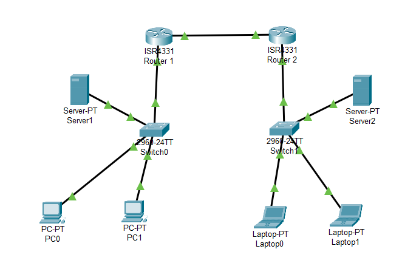

## ⚙️ Konfigurasi Singkat

### IP Addressing
| Perangkat     | IP Address       | Gateway        |
|---------------|------------------|----------------|
| PC0           | DHCP (192.168.1.x) | 192.168.1.1   |
| PC1           | DHCP (192.168.1.x) | 192.168.1.1   |
| Laptop0       | DHCP (192.168.2.x) | 192.168.2.1   |
| Laptop1       | DHCP (192.168.2.x) | 192.168.2.1   |
| Server1       | 192.168.1.10      | 192.168.1.1   |
| Server0       | 192.168.2.10      | 192.168.2.1   |

### Routing
- Router1 -> Router2: static route ke `192.168.2.0/24`
- Router2 -> Router1: static route ke `192.168.1.0/24`

## 🖥️ Tools

- Cisco Packet Tracer
- GitHub untuk dokumentasi

## 🚀 Potensi Pengembangan

- NAT konfigurasi untuk internet simulasi
- VLAN untuk segmentasi jaringan
- Firewall ACL
- OSPF / EIGRP dynamic routing

## 📸 Screenshot

---

> Feel free to fork or improve this project. Pull requests are welcome!
